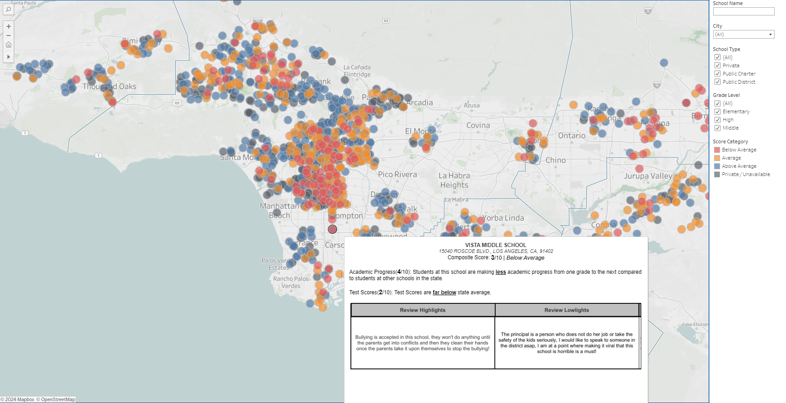

# BrightFutures


## Project Overview

This project is born out of a forward-thinking approach to educational planning. Living in Los Angeles and recognizing the challenges of finding the right school in Southern California, this initiative aims to provide a comprehensive view of schools across the region. The project leverages web scraping to compile a database of schools, followed by data enrichment and visualization through a web dashboard, making it easier for parents and guardians to make informed decisions about their children's education.

## Key Features
- **Dynamic Web Scraping:** Automated extraction of comprehensive school data from multiple educational portals using Python & Selenium.
- **Data Enrichment & Geocoding:** Enhancement of the dataset with geographical coordinates and other relevant information using Python and geopy.
- **Efficient Data Warehousing with Snowflake:** Utilization of Snowflake's cloud platform for data storage, along with Snowpipe for seamless, automated data ingestion.
- **Interactive Data Visualizations:** Creation of insightful charts and maps with Tableau, making complex data easily interpretable.


## Technologies Used
- Python & Selenium for web scraping
- geopy for data enrichment and geocoding
- Snowflake & Snowpipe for data storage and ingestion
- Tableau for data visualization

## Getting Started

### Prerequisites
- Python 3.x
- Selenium WebDriver
- A Snowflake account
- Tableau Desktop or Public

### Installation
Clone the repository:
   ```bash
   git clone https://github.com/yourusername/school-selection-tool.git
   ```
Install Requirements
```bash
pip install -r requirements.txt
```

